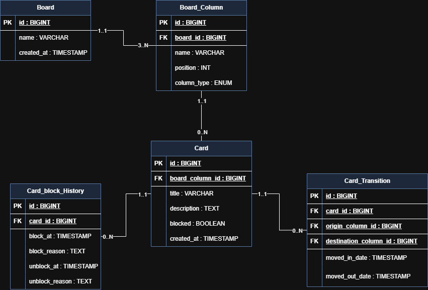
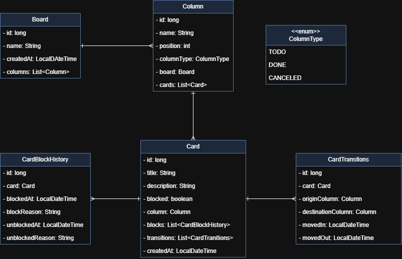

# 🗂️ Projeto de Board para Gerenciamento de Tarefas

> 💡 Um sistema interativo em Java com integração a banco de dados PostgreSQL para controle de tarefas através de boards customizáveis. Ideal para times ágeis e organização de fluxo de trabalho.

---

## 📋 Funcionalidades Principais

### 📌 Menu Inicial
Ao iniciar, o sistema apresenta as seguintes opções:

1. ➕ Criar novo board
2. 🔍 Selecionar board
3. 🗑️ Excluir boards
4. ❌ Sair

---

## 🧩 Regras dos Boards

### 🏷️ Estrutura do Board
- Um board deve conter:
    - Nome único
    - Pelo menos **3 colunas**:
        - ✅ Coluna Inicial (Ex: "A Fazer")
        - 🟡 Colunas Pendentes (Ex: "Em Progresso", "Revisão")
        - ✔️ Coluna Final (Ex: "Concluído")
        - ❌ Coluna de Cancelamento (Ex: "Canceladas")

#### 🔢 Ordem das Colunas
- A **coluna inicial** deve ser **a primeira**
- A **coluna final** deve ser **a penúltima**
- A **coluna de cancelamento** deve ser **a última**
- Colunas pendentes podem ser adicionadas entre a inicial e a final

#### 🔄 Regras de Navegação
- Os cards devem seguir **a ordem das colunas**, sem pular nenhuma
- É permitido mover diretamente para a coluna de cancelamento **de qualquer coluna**, exceto da final

---

### 🧾 Cards

Cada **card** contém:

- 🏷️ Título
- 📝 Descrição
- 🕒 Data de criação
- 🔒 Status de bloqueio (sim/não)
- 🧭 Histórico de movimentações (opcional)
- 📌 Justificativas de bloqueio/desbloqueio (se aplicável)

#### ⚠️ Bloqueios
- Cards **bloqueados não podem ser movidos**
- Para **bloquear**, é necessário informar o motivo
- Para **desbloquear**, também deve ser informado o motivo

---

## 🧪 Menu de Manipulação de Board Selecionado

Ao selecionar um board, o sistema deve permitir:

1. 🔁 Mover card para a próxima coluna
2. ❌ Cancelar um card
3. 🆕 Criar um novo card
4. 🔒 Bloquear um card
5. 🔓 Desbloquear um card
6. 🔙 Fechar board

---

## 🎁 Requisitos Opcionais

### ⏱️ Histórico de Tempo dos Cards
- Armazenar:
    - Data e hora de entrada em uma coluna
    - Data e hora de saída para próxima coluna

### 📊 Relatórios

#### 📈 Tempo por Card
- Geração de relatório com:
    - Tempo total da tarefa
    - Tempo gasto em cada coluna

#### 🧯 Bloqueios
- Relatório contendo:
    - Motivos de bloqueio/desbloqueio
    - Duração do bloqueio de cada card

---

## 🛢️ Banco de Dados

- Todos os boards, colunas, cards e históricos devem ser salvos em um banco de dados escolhido.

---

> 💡 Este projeto é ideal para organizar fluxos de tarefas complexos, rastrear progresso e melhorar a produtividade em equipes que usam metodologias ágeis.
---

# 🛠️ Estrutura do Projeto

## 🧮 DER: 

> - Diagrama Entidade/Relacionamento representados no banco

---

## 🏷️ Classes:

> - Diagrama de classes com os modelos das entidades Java

---