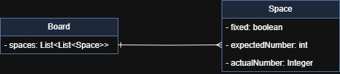

# 🕹️ Sudoku - Game

> 💡 Este projeto implementa um jogo de Sudoku jogável via boardMenu interativo no console. O jogador poderá iniciar o jogo, inserir e remover números, verificar o status do tabuleiro e finalizar a partida.

---

## 🎮 Menu Interativo

>Ao executar o programa, o usuário terá acesso a um boardMenu com as seguintes opções:

---

### 1️⃣ Iniciar um novo jogo

- Inicia um novo tabuleiro de Sudoku.
- Os números iniciais (fixos) devem ser passados como argumentos ao método `main`.
- As posições fixas são preenchidas de acordo com os argumentos e não poderão ser modificadas depois.

---

### 2️⃣ Colocar um novo número

- **Solicita ao jogador**:
    - Número a ser colocado
    - Índice horizontal (coluna)
    - Índice vertical (linha)
  

- **Validações**:
    - Não é permitido inserir um número em uma célula que já está preenchida (fixa ou preenchida anteriormente).

---

### 3️⃣ Remover um número

- Solicita os índices `vertical` e `horizontal` da posição que deseja limpar.


- **Validações**:
    - Números fixos do jogo **não podem ser removidos**.
    - Caso a posição contenha um número fixo, deve ser exibida uma mensagem de erro.

---

### 4️⃣ Verificar o jogo

- Exibe o estado atual do tabuleiro, com todos os números preenchidos (fixos e adicionados pelo jogador).

---

### 5️⃣ Verificar status do jogo

Verifica o **estado geral do jogo**, podendo retornar:

- **Não iniciado**: nenhum número foi colocado ainda (sem erros).
- **Incompleto**: há espaços em branco (pode conter erros).
- **Completo**: todas as posições foram preenchidas.

Além disso, valida se existem **erros de conflito**

---

## 🛠️ Estrutura do Projeto

### 📑 Diagrama de Classes:


---

### 🖍️ Modelo de board exibido no terminal:
````text
*************************************************************************************
*|---0---||---1---||---2---|*|---3---||---4---||---5---|*|---6---||---7---||---8---|*
*|       ||       ||       |*|       ||       ||       |*|       ||       ||       |*
0|  %s   ||  %s   ||  %s   |*|  %s   ||  %s   ||  %s   |*|  %s   ||  %s   ||  %s   |0
*|       ||       ||       |*|       ||       ||       |*|       ||       ||       |*
*|-------||-------||-------|*|-------||-------||-------|*|-------||-------||-------|*
*|-------||-------||-------|*|-------||-------||-------|*|-------||-------||-------|*
*|       ||       ||       |*|       ||       ||       |*|       ||       ||       |*
1|  %s   ||  %s   ||  %s   |*|  %s   ||  %s   ||  %s   |*|  %s   ||  %s   ||  %s   |1
*|       ||       ||       |*|       ||       ||       |*|       ||       ||       |*
*|-------||-------||-------|*|-------||-------||-------|*|-------||-------||-------|*
*|-------||-------||-------|*|-------||-------||-------|*|-------||-------||-------|*
*|       ||       ||       |*|       ||       ||       |*|       ||       ||       |*
2|  %s   ||  %s   ||  %s   |*|  %s   ||  %s   ||  %s   |*|  %s   ||  %s   ||  %s   |2
*|       ||       ||       |*|       ||       ||       |*|       ||       ||       |*
*|-------||-------||-------|*|-------||-------||-------|*|-------||-------||-------|*
*************************************************************************************
*|-------||-------||-------|*|-------||-------||-------|*|-------||-------||-------|*
*|       ||       ||       |*|       ||       ||       |*|       ||       ||       |*
3|  %s   ||  %s   ||  %s   |*|  %s   ||  %s   ||  %s   |*|  %s   ||  %s   ||  %s   |3
*|       ||       ||       |*|       ||       ||       |*|       ||       ||       |*
*|-------||-------||-------|*|-------||-------||-------|*|-------||-------||-------|*
*|-------||-------||-------|*|-------||-------||-------|*|-------||-------||-------|*
*|       ||       ||       |*|       ||       ||       |*|       ||       ||       |*
4|  %s   ||  %s   ||  %s   |*|  %s   ||  %s   ||  %s   |*|  %s   ||  %s   ||  %s   |4
*|       ||       ||       |*|       ||       ||       |*|       ||       ||       |*
*|-------||-------||-------|*|-------||-------||-------|*|-------||-------||-------|*
*|-------||-------||-------|*|-------||-------||-------|*|-------||-------||-------|*
*|       ||       ||       |*|       ||       ||       |*|       ||       ||       |*
5|  %s   ||  %s   ||  %s   |*|  %s   ||  %s   ||  %s   |*|  %s   ||  %s   ||  %s   |5
*|       ||       ||       |*|       ||       ||       |*|       ||       ||       |*
*|-------||-------||-------|*|-------||-------||-------|*|-------||-------||-------|*
*************************************************************************************
*|-------||-------||-------|*|-------||-------||-------|*|-------||-------||-------|*
*|       ||       ||       |*|       ||       ||       |*|       ||       ||       |*
6|  %s   ||  %s   ||  %s   |*|  %s   ||  %s   ||  %s   |*|  %s   ||  %s   ||  %s   |6
*|       ||       ||       |*|       ||       ||       |*|       ||       ||       |*
*|-------||-------||-------|*|-------||-------||-------|*|-------||-------||-------|*
*|-------||-------||-------|*|-------||-------||-------|*|-------||-------||-------|*
*|       ||       ||       |*|       ||       ||       |*|       ||       ||       |*
7|  %s   ||  %s   ||  %s   |*|  %s   ||  %s   ||  %s   |*|  %s   ||  %s   ||  %s   |7
*|       ||       ||       |*|       ||       ||       |*|       ||       ||       |*
*|-------||-------||-------|*|-------||-------||-------|*|-------||-------||-------|*
*|-------||-------||-------|*|-------||-------||-------|*|-------||-------||-------|*
*|       ||       ||       |*|       ||       ||       |*|       ||       ||       |*
8|  %s   ||  %s   ||  %s   |*|  %s   ||  %s   ||  %s   |*|  %s   ||  %s   ||  %s   |8
*|       ||       ||       |*|       ||       ||       |*|       ||       ||       |*
*|---0---||---1---||---2---|*|---3---||---4---||---5---|*|---6---||---7---||---8---|*
*************************************************************************************
````
---

## ✍️ Exemplo de board completo passado como args no main:

> 💡`coluna`,`linha`;`valorEsperado`,`fixed`
````text
0,0;4,false 
1,0;7,false 
2,0;9,true 
3,0;5,false 
4,0;8,true 
5,0;6,true 
6,0;2,true 
7,0;3,false 
8,0;1,false 
...
8,8;9,false
````
